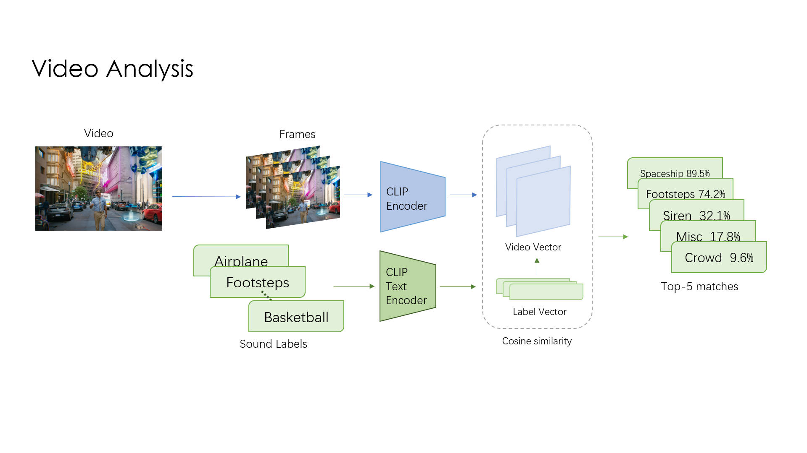
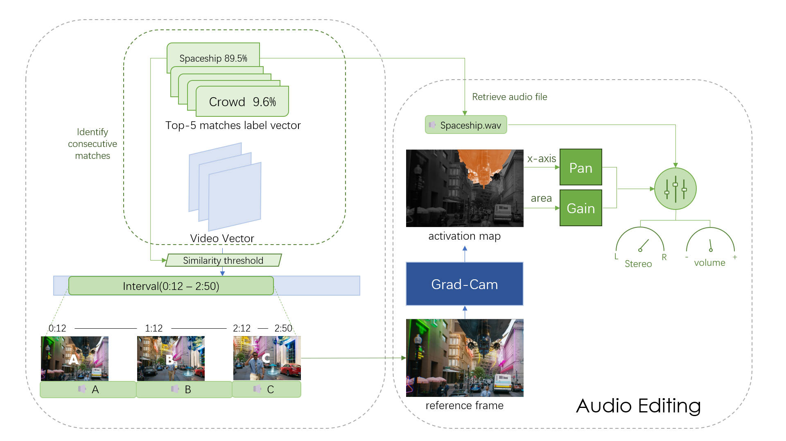

# AutoSFX
Author: Lingxiao Fang

## Project Overview
This work introduced AutoSFX, an innovative system designed to automate the process of matching and synchronizing sound effects with video content. It comprises three primary modules: video analysis, audio-video synchronisation, and audio editing. By leveraging CLIP  and computer vision techniques, AutoSFX addresses the time-consuming nature of traditional sound effect editing in video production. It offers a fully automated workflow that enhances efficiency and bridges the gap between theory and application.The effectiveness of AutoSFX was demonstrated through both quantitative and qualitative evaluations.

## Approach



---
## Usage
Here's a step-by-step guide on.

### Environment Setup

This project is developed using `Python 3.9`. 

To set up the environment, please install all required packages listed in the `requirements.txt` file:

```
pip install -r requirements.txt
```

It is recommended to use a virtual environment to manage the project dependencies. You can create and activate a virtual environment with the following commands:

```bash
# Create a virtual environment
python3.9 -m venv venv

# Activate the virtual environment (Linux/macOS)
source venv/bin/activate

# Activate the virtual environment (Windows)
venv\Scripts\activate
```
This project uses CLIP model and Grad-Cam model.

### Installation
To use this project, you need to install the required dependencies:

Install OpenCLIP:
```
pip install open_clip_torch
```

Install Grad-CAM:
Grad-CAM is typically used as a submodule in projects. To add it to your project, use the following git commands:

```
git submodule add https://github.com/jacobgil/pytorch-grad-cam.git```
git submodule update --init --recursive
```
Then, navigate to the pytorch-grad-cam directory and install it:
```
pytorch-grad-cam
pip install -e .
```
For more detail, see [OpenCLIP](https://github.com/mlfoundations/open_clip.git) repository and [Grad-CAM](https://github.com/ramprs/grad-cam.git) repository.

### Dataset

This project uses the [ESC-50 Dataset](https://github.com/karolpiczak/ESC-50.git) for sound effects library. Please download this dataset and put it under `data` folder before use.

#### Downloading Test Data
The test dataset is a subset derived from [VGGSound](https://github.com/hche11/VGGSound.git). To download the test dataset, use the following command:
```
python download_vggsound.py --csv_path "path-to-your-test-data-csv" --output_dir "path-to-your-output-folder" --num_samples [test data number]
```
Running Test
```
python test.py --csv_path "path-to-your-test-data-csv" --video_dir "path-to-your-test-video-data" --num_samples 250 --output_dir "path-to-your-output-folder"
```

### Using AutoSFX
To use AutoSFX, you need to run the `AutoSFX.ipynb`.